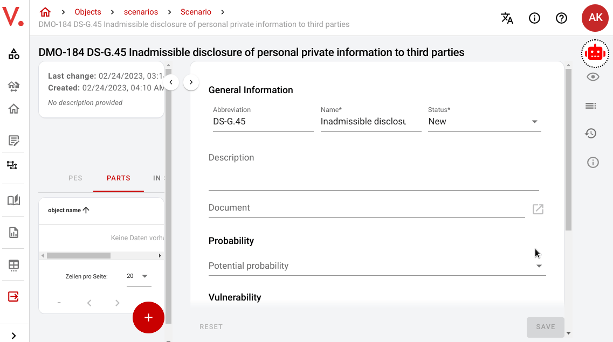

# Verinice.veo Copilo (beta)

A Tampermonkey script that adds AI functions to verinice.veo, the open source ISMS tool. You will need an API key for the OpenAI API which is available on their website. You will also need access to verinice.veo by SerNet. This open source project is not affiliated with or endorsed by OpenAI or SerNet in any way.

## Introduction

verinice.veo Copilot is a Tampermonkey script that enhances the functionality of the verinice.veo application by incorporating AI technologies. With the script, you can access AI features directly from the verinice.veo platform, making it easier to use and more efficient.

## Features

- Adds an AI-powered copilot to verinice.veo
- Runs using the Tampermonkey extension which is available for most major browsers: Chrome, Microsoft Edge, Firefox, Safari and Opera Next
- Integrates with OpenAI API
- Integrates with verinice.veo ISMS tool
- AI chat function built in
- Quick Actions built in such as
  - writing a description for an existing element
  - writing a breach notification for an incident
  - suggesting new elements based on existing ones
  - creating the suggested elements
  - classifying and grouping existing elements
  - Summarize text currently in the clipboard

<u>__Demonstration:__</u>

## Getting Started

1. Install Tampermonkey. If you don't have Tampermonkey installed, you can
   download it from the [Tampermonkey website](https://tampermonkey.net/) or
   from your browser's add-on store.

2. Install the Verinice.veo Copilot Beta script. You can do this by visiting
   the following link and clicking the "Install" button: [Verinice.veo Copilot
   Beta Tampermonkey Script](<link to script>). Alternatively you can copy and
   paste the source code of the script from the Github repository into the
   tampermonkey plugin.

3. Get an OpenAI API key. You can get a free API key from the [OpenAI
   website](https://beta.openai.com/signup/).

4. Log in to verinice.veo

5. If verinice.veo Copilot is running, you should see a robot button in the top right corner. Click on it to open the UI.

6. Paste your API key into the corresponding input field on the Verinice.veo Copilot Beta script.

7. You can now use all functions. Open and close the copilot dialog as needed with the button in the top right corner.

## Usage

To use the Verinice.veo Copilot Beta, simply open the verinice.veo platform and click the robot button in the top right corner to open/close the copilot dialog.

## Contributing

If you would like to contribute to the development of Verinice.veo Copilot Beta, please feel free to open an issue or a PR.

## License

Verinice.veo Copilot Beta is released under the [MIT License](https://opensource.org/licenses/MIT).

